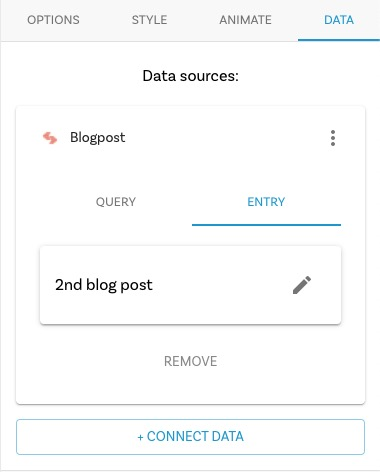

# Khulnasoft.com Contentstack plugin

Connect your Contentstack data to your Khulnasoft.com content!

## Installation

Go to [khulnasoft.com/integrations](https://khulnasoft.com/app/integrations), find the Contentstack card, and click the "Enable" button. You will then be prompted to enter your `apiKey`, `accessToken` and `environment` next, which you can get from your contentstack settings tab. To find out more, visit the [contentstack docs](https://www.contentstack.com/docs/developers/apis/content-delivery-api/#authentication) (look for "How to Get API Key and Delivery Token")

## Usage

Once installed, you'll have the option to query your Contentstack content and bind it in your khulnasoft.com sections and pages

